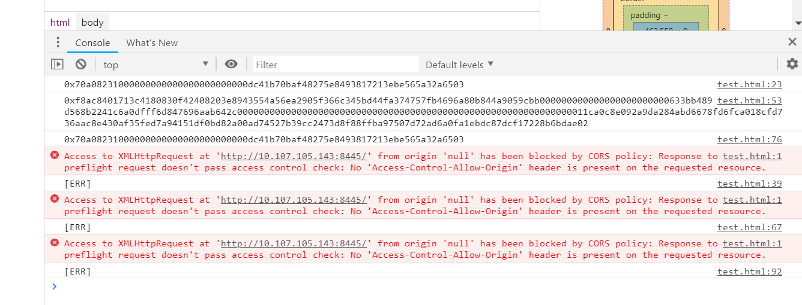
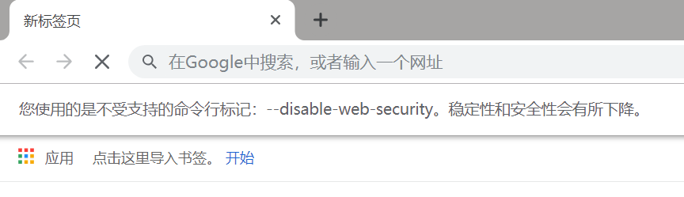
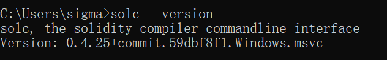

# FISCO-JS 帮助文档

## 一、描述

### 1.1、基本描述

**基于FISCO-BCOS1.3里的web3lib制作，适用于FISCO2.0**

在[FISCO2.0](https://github.com/FISCO-BCOS/FISCO-BCOS/tree/release-2.0.0-rc2)里，JS的web3lib库被[JSON-RPC API](https://fisco-bcos-documentation.readthedocs.io/zh_CN/release-2.0/docs/api.html)替代，调用合约的call和sendRawTransaction这两个接口，入参数据需要拼接签名，本工具就是用来处理这个数据，处理后的数据可通过http发送到JSON-RPC API。

### 1.2、关于版本

本工具有两个版本：

**Web版**：浏览器Chrome/FireFox里运行的版本，已给出简单的示例 [web/test.html](./web/test.html)

**NodeJS版**：NodeJS里运行的版本，已给出简单的示例 [web3lib/test.js](./web3lib/test.js)


## 二、使用前提

### 2.1、部署合约

这是一切的前提，示例里使用的是[HelloWorld合约](./web3lib/contract/HelloWorld.sol)。

### 2.1、Web版

由于跨域问题，浏览器会阻止http请求，如下：



这是浏览器自身的安全机制造成的，再chrome下需要屏蔽跨域检查，在桌面chrome快捷方式-右键-属性-目标，加上一行--disable-web-security，注意空格，比如
C:\Users\xxx\AppData\Local\Google\Chrome\Application\chrome.exe --disable-web-security --user-data-dir=C:\MyChromeDevUserData

打开chrome，出现以下提示表示屏蔽成功：



### 2.2、NodeJS版

已测试通过的NodeJS版本：win10 64bit v10.8.0

为了保证包的一致性，建议不要用npm下载依赖，所有依赖示例中已给出，git clone下来就都有了。


## 三、使用方法

### 3.1、Web版

web版通过NodeJS版转换而来，并重命名为[fiscoUtil.js](./web/js/fiscoUtil.js)，导入fiscoUtil.js：

```
<script src="js/fiscoUtil.js"></script>
```
在JS代码里导入模块：

```
const fiscoUtil = require('fiscoUtil')
const BN = require('bn.js')
```

**注意：自带的bn.js和以太坊常用的bignumber.js不是一个库！**

#### 3.1.1、Web版call

通过fiscoUtil.getTxData()来拼接call的参数，仅用于读取合约，无需签名

```
var func = 'get()'
var params = []
var txData = fiscoUtil.getTxData(func, params)
```

如果你还没有解决跨域问题的话，这里拿到的txData可以在postman里调试。（注：postman是常用的接口调试软件）

#### 3.1.2、Web版sendRawTransaction

通过fiscoUtil.getSignTX()来拼接签名sendRawTransaction的参数，仅用于写入合约，需要用私钥签名

```
var account = '0xdc41b70baf48275e8493817213ebe565a32a6503'
var privateKey = 'e59ac4433e9d5675028a44ac3ca6bbbd81587059df0c41507c88bb5eaef43de6'
var contractAddress = '0x3554a56ea2905f366c345bd44fa374757fb4696a' //合约地址
var func = 'set(string)'
var params = ['fisco js sdk !']
var signTX = fiscoUtil.getSignTX(account, privateKey, contractAddress, func, params, 1000)
```

这里示范了写入 0x3554a56ea2905f366c345bd44fa374757fb4696a 合约， e59ac4433e9d5675028a44ac3ca6bbbd81587059df0c41507c88bb5eaef43de6 是 0xdc41b70baf48275e8493817213ebe565a32a6503 的私钥，1000是blockLimit，正常情况应该是当前区块高度+1000，这里省略了。

### 3.2、NodeJS版

导包

```
const web3sync = require('./web3sync')
const BN = require('bn.js')
```

第一个是导入./web3sync.js，第二个是导入bn.js模块。

使用方法与Web版类同，不再复述。

## 四、部署合约
仅NodeJS支持该功能，因为Web版不能调用solc编译器

需要先安装[FISCO solc编译器](https://github.com/FISCO-BCOS/solidity/releases)，建议下载0.4.25版本，解压后配置好环境变量即可，打开命令行，输入solc --version：



说明安装成功！

导包

```
const fs = require('fs')
const execSync = require('child_process').execSync
```

编译.sol合约文件

```
execSync('solc --bin -o ./contract ./contract/HelloWorld.sol')
var bin = fs.readFileSync('./contract/HelloWorld.bin', 'utf-8')
```

这里意思是把 HelloWorld.sol 编译到 contract 文件夹，如果编译的.sol 引用了其它的.sol，会一起编译。编译成功后，读取 HelloWorld.bin 为字符串（注意这里字符串不带0x前缀）

```
var signTX = web3sync.getDeploySignTX(account, privateKey, bin, 1000)
```

getDeploySignTX() 自动处理了bin的0x前缀问题，1000是blockLimit，正常情况应该是当前区块高度+1000，这里省略了。最后通过 sendRawTransaction 发送到JSON-RPC，已给出简单的示例 [web3lib/test.js](./web3lib/test.js)


## 五、目前已知问题

1.太臃肿，后续再优化

2.不支持合约事件功能，待FISCO2.0 API接口开放